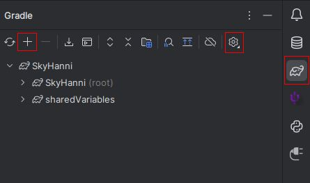
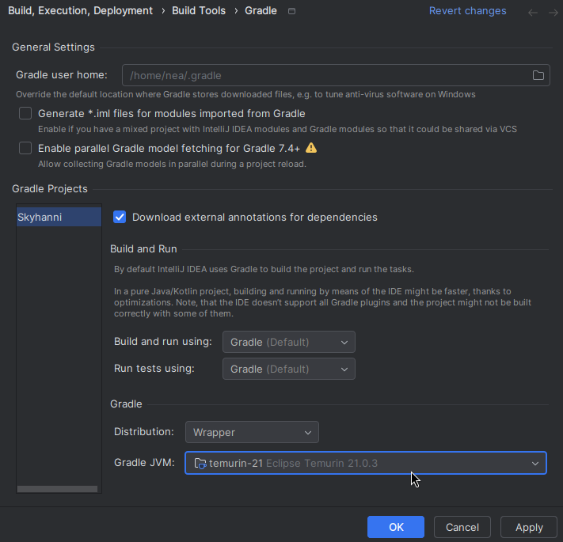
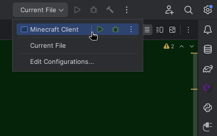

# How to Contribute

This is a technical guide that helps Kotlin and Java developers understand how SkyHanni works, and provides the first
steps for new Forge developers to take.

## Development Environment Setup

When making changes to the code, it is recommended to use an IDE for live debugging and testing.
This tutorial explains how to set up the development environment for SkyHanni.
We use [IntelliJ](https://www.jetbrains.com/idea/) as an example.

### Download IntelliJ

- Download IntelliJ from the [JetBrains Website](https://www.jetbrains.com/idea/download/).
    - Use the Community Edition. (Scroll down a bit.)

### Cloning the project

- Create an account on GitHub
    - Go to https://github.com/hannibal002/SkyHanni
    - Click on the fork button to create a fork.
        - Leave the settings unchanged
        - Click on `create fork`
    - Open IntelliJ
        - Link the GitHub account with IntelliJ.
        - Install Git in IntelliJ.
        - In IntelliJ, go to `new` → `project from version control`.
        - Select `SkyHanni` from the list.
        - Open the project.

### Setting up IntelliJ

Once your project is imported into IntelliJ from the previous step, all dependencies like Minecraft, NEU, and so on should be automatically
downloaded. If not, you might need to link the Gradle project in the Gradle tab (little elephant) on the right.

<details>
<summary>🖼️Show Gradle tab image</summary>



</details>

If importing fails, make sure the Gradle JVM (found in the settings wheel in the Gradle tab, or by searching <kbd>Ctrl + Shift + A</kbd>
for "Gradle JVM") is set to a Java 21 JDK. While this is not the version of Java Minecraft 1.8.9 uses, we need this version for some of our
build tools.

<details>
<summary>🖼️Show Gradle JVM image</summary>



</details>

After all importing is done (which might take a few minutes the first time you download the project), you should find a new IntelliJ run
configuration.

<details>
<summary>🖼️Show run configuration selection image</summary>



</details>

That task might work out of the box, but very likely it will not. We will need to adjust the used Java version. Since Minecraft 1.8.9 uses
Java 1.8, we will need to adjust the used JDK for running our Mod, as well as potentially changing the argument passing style.

So select an appropriate Java 1.8 JDK (preferably [DCEVM](#hot-swap), but any Java 1.8 JDK or even JRE will do) and select None as the
argument passing style.

<details>
<summary>🖼️Show run configuration image</summary>


</details>

Now that we are done with that, you should be able to launch your game from your IDE with that run configuration.

SkyHanni's Gradle configuration is very similar to the one used in **NotEnoughUpdates**, so if you want to look at another guide, check
out [their guide](https://github.com/NotEnoughUpdates/NotEnoughUpdates/blob/master/CONTRIBUTING.md).

## Creating a Pull Request

If you are not very familiar with git, you might want to try this out: https://learngitbranching.js.org/.

_An explanation how to use intellij and branches will follow here soon._

Please use a prefix for the name of the PR (E.g. Feature, Improvement, Fix, Backend, ...).

When writing the description of the PR, ensure you fill out the template with the necessary information, including the "WHAT" section, and the changelog entries.

If your PR relies on another PR, please include this information at the beginning of the description. Consider using a
format like "- #821" to illustrate the dependency.

## Coding Styles and Conventions

- Follow the [Hypixel Rules](https://hypixel.net/rules).
- Use the coding conventions for [Kotlin](https://kotlinlang.org/docs/coding-conventions.html)
  and [Java](https://www.oracle.com/java/technologies/javase/codeconventions-contents.html).
-  **My build is failing due to `detekt`, what do I do?**
    - `detekt` is our code quality tool. It checks for code smells and style issues.
    - If you have a build failure stating `Analysis failed with ... weighted issues.`, you can check `versions/[target version]/build/reports/detekt/` for a comprehensive list of issues.
    - **There are valid reasons to deviate from the norm**
        - If you have such a case, either use `@Supress("rule_name")`, or re-build the `baseline.xml` file, using `./gradlew detektBaseline`. 
- Do not copy features from other mods. Exceptions:
    - Mods that are paid to use.
  - Mods that have reached their end of life. (Rip SBA, Dulkir and Soopy).
    - The mod has, according to Hypixel rules, illegal features ("cheat mod/client").
    - If you can improve the existing feature in a meaningful way.
- All new classes should be written in Kotlin, with a few exceptions:
    - Config files in `at.hannibal2.skyhanni.config.features`
    - Mixin classes in `at.hannibal2.skyhanni.mixins.transformers`
- New features should be made in Kotlin objects unless there is a specific reason for it not to.
    - If the feature needs to use forge events or a repo pattern, annotate it with `@SkyHanniModule`
    - This will automatically register it to the forge event bus and load the repo patterns
- Avoid using deprecated functions.
    - These functions are marked for removal in future versions.
    - If you're unsure why a function is deprecated or how to replace it, please ask for guidance.
- Future JSON data objects should be made in kotlin and placed in the directory `at.hannibal2.skyhanni.data.jsonobjects`
    - Config files should still be made in Java.
- Please use the existing event system, or expand on it. Do not use Forge events.
    - (We inject the calls with Mixin)
- Please use existing utils methods.
- We try to avoid calling the NEU code too often.
    - (We plan to remove NEU as a dependency in the future.)
- We try not to use Forge-specific methods if possible.
    - (We plan to switch to Fabric and Minecraft 1.20 in the future.)
- Please try to avoid using `System.currentTimeMillis()`. Use our own class `SimpleTimeMark` instead.
    - See [this commit](https://github.com/hannibal002/SkyHanni/commit/3d748cb79f3a1afa7f1a9b7d0561e5d7bb284a9b)
      as an example.
- Try to avoid using Kotlin's `!!` (catch if not null) feature.
    - Replace it with `?:` (if null return this).
    - This will most likely not be possible to avoid when working with objects from java.
- Don't forget to add `@FeatureToggle` to new standalone features (not options to that feature) in the config.
- Do not use `e.printStackTrace()`, use `ErrorManager.logErrorWithData(error, "explanation for users", ...extraOptionalData)` instead.
- Do not use `MinecraftForge.EVENT_BUS.post(event)`, use `event.post()` instead.
- Do not use `toRegex()` or `toPattern()`, use `RepoPattern` instead.
    - See [RepoPattern.kt](https://github.com/hannibal002/SkyHanni/blob/beta/src/main/java/at/hannibal2/skyhanni/utils/repopatterns/RepoPattern.kt)
for more information and usages.
    - The pattern variables are named in the scheme `variableNamePattern`
- Please use Regex instead of String comparison when it is likely Hypixel will change the message in the future.
- Do not use `fixedRateTimer` when possible and instead use `SecondPassedEvent` to safely execute the repeating event on
  the main thread.
- When updating a config option variable, use the `ConfigUpdaterMigrator.ConfigFixEvent` with event.move() when moving a value, and event.transform() when updating a value. [For Example](https://github.com/hannibal002/SkyHanni/blob/e88f416c48f9659f89b7047d7629cd9a1d1535bc/src/main/java/at/hannibal2/skyhanni/features/gui/customscoreboard/CustomScoreboard.kt#L276).
- Use American English spelling conventions (e.g., "color" not "colour").

## Software Used in SkyHanni

### Basics

SkyHanni is a Forge mod for Minecraft 1.8.9, written in [Kotlin](https://kotlinlang.org/)
and [Java](https://www.java.com/en/).

We use a [Gradle configuration](https://gradle.org/) to build the mod,
written in [Kotlin DSL](https://docs.gradle.org/current/userguide/kotlin_dsl.html):
[build.gradle.kts](https://github.com/hannibal002/SkyHanni/blob/beta/build.gradle.kts)

This start script will automatically download all required libraries.

### NotEnoughUpdates

SkyHanni requires **[NotEnoughUpdates](https://github.com/NotEnoughUpdates/NotEnoughUpdates/)**.
We use NEU to get auction house and bazaar price data for items and to read
the [NEU Item Repo](https://github.com/NotEnoughUpdates/NotEnoughUpdates-REPO) for item internal names, display names
and recipes.

### Config

SkyHanni stores the config (settings and user data) as a json object in a single text file.
For rendering the /sh config (categories, toggles, search, etc.),
SkyHanni uses **[MoulConfig](https://github.com/NotEnoughUpdates/MoulConfig)**, the same config system as NotEnoughUpdates.

### Elite Farmers API

SkyHanni utilizes the [Elite API](https://api.elitebot.dev/) (view the [public site here](https://elitebot.dev)) for
some farming features.

This includes features relating to Farming Weight, as well as syncing jacob contests amongst players for convenience.
All data sent is anonymized and opt-in.

### Mixin

A system to inject code into the original Minecraft code.
This library is not part of SkyHanni or Forge, but we bundle it.

It allows to easily modify methods in Minecraft itself, without conflicting with other mods.

For more information, see https://github.com/SpongePowered/Mixin or [our existing mixins](https://github.com/hannibal002/SkyHanni/tree/beta/src/main/java/at/hannibal2/skyhanni/mixins/transformers).

When creating new Mixins, try to keep the code inside the mixin as small as possible, and calling a hook as soon as
possible.

### Repo

SkyHanni uses a repo system to easily change static variables without the need for a mod update.
The repo is located at https://github.com/hannibal002/SkyHanni-REPO.
A copy of all json files is stored on the computer under `.minecraft\config\skyhanni\repo`.
On every game start, the copy gets updated (if outdated and if not manually disabled).
If you add stuff to the repo make sure it gets serialised. See
the [JsonObjects](src/main/java/at/hannibal2/skyhanni/data/jsonobjects/repo)
folder for how to properly do this. You also may have to disable repo auto update in game.

### Discord IPC

DiscordIPC is a service that SkyHanni uses to send information from SkyBlock to Discord in Rich Presence. <br>
For info on usage, look at [DiscordRPCManager.kt](https://github.com/hannibal002/SkyHanni/blob/beta/src/main/java/at/hannibal2/skyhanni/features/misc/discordrpc/DiscordRPCManager.kt)

### Auto Updater

We use the [auto update library](https://github.com/nea89o/libautoupdate) from nea89.

## Additional Useful Development Tools

### DevAuth

[DevAuth](https://github.com/DJtheRedstoner/DevAuth) is a tool that allows logging in to a Minecraft account while
debugging in IntelliJ. This is very useful for coding live on Hypixel without the need to compile a jar.

- The library is already downloaded by Gradle.
- SkyHanni will automatically set up DevAuth.
- Start Minecraft inside IntelliJ normally.
    - Click on the link in the console and verify with a Microsoft account.
    - The verification process will reappear every few days (after the session token expires).

### Hot Swap

Hot Swap allows reloading edited code while debugging, removing the need to restart the whole game every time.

We use [dcevm](https://dcevm.github.io/) and the IntelliJ
Plugin [HotSwap Agent](https://plugins.jetbrains.com/plugin/9552-hotswapagent) to quickly reload code changes.

Follow [this](https://forums.Minecraftforge.net/topic/82228-1152-3110-intellij-and-gradlew-forge-hotswap-and-dcevm-tutorial/)
tutorial.

## 1.21 / Modern version development

You might have noticed that while the SkyHanni source code is found in `src/`, the actual tasks for compiling, building and running the mod
are located in a subproject called `1.8.9`. This is because SkyHanni is preparing for the eventual fall of 1.8.9 (via the foraging update or
otherwise).

To do so (while not disrupting regular development) we use [preprocessor](https://github.com/Deftu/RM-Preprocessor). Preprocessor
automatically transforms code based on mappings as well as comment directives to create multiple variants of your source code for
different Minecraft versions.

Note also that the only targets we consider are 1.8.9 and 1.21 (or whatever the latest version we may target). The other versions are only there
to make mappings translate more easily (more on that later).

### Goals

It is the explicit goal of this operation to passively generate a 1.21 version of SH using preprocessor. To this end, contributors are
encouraged to add mappings and preprocessing directives to their features to make them compile on 1.21. *However*, this is considered a very
low priority. Due to the confusing nature (and the slower initial setup time due to decompiling four versions of Minecraft), this feature
is disabled by default. Similarly, it is up to each contributor to decide if they want to learn how to use preprocessor mappings and
directives. An explicit non-goal is to maintain two SH versions continuously; instead, we only want to make the eventual transition to 1.21 a task
that can be slowly worked on over a long span of time.

### Set Up

The modern version variants can be set using `skyhanni.multi-version` in `.gradle/private.properties` to three levels.

`off` completely disables any preprocessor action or alternative versions. There will be only one project (although still at the `:1.8.9`
subproject path), and alternative version sources will not be generated (although old generated sources **will not be deleted**). To make
setting up a dev environment as fast and discernible as possible, this is the default option.

`preprocess-only` adds the `preprocessCode` task as well as all the version subprojects. Compiling or running newer versions is not
possible, but the `preprocessCode` task can be run manually to inspect the generated source code. This mode is what should most often be
used when making alterations to the mappings or modifying preprocessor directives. Note that while this setting generally ignores any failed
renaming attempts, if something is so badly mangled that it cannot even guess a name for a function, it will still break the build. Those
situations should be rare, however. (In the entire SH codebase prior to me introducing this system I only found <10 such cases). You can
specifically compile 1.8.9 using `./gradlew :1.8.9:build`. This does not affect the regular execution of the client which will only compile
1.8.9.

`compile` enables compilation for the `:1.21` subproject. This means that a `build` or `assemble` task will try (and fail) to compile a
1.21 (as well as 1.8.9) JAR. This mode may be useful for someone seeking out issues to fix, but is generally not useful in day to day
operations since the compile will never succeed and will block things like hotswap compilations (via <kbd>CTRL+F9</kbd>) from completing.

### Improving mappings

The different project versions are set up in such a way that each version depends on a slightly older version from which it is then adapted.
There are two main versions (1.8.9 and 1.21), but there are also a few bridge versions. These exist to make remapping easier since automatic
name mappings between 1.8.9 and 1.21 do not really exist. This is the current layout for our remaps: First, we remap to 1.12. This still
largely uses the old rendering system and has a lot of similar names to 1.8.9. As such, only very little needs to be adapted in terms of
behaviour, and at best, a couple of names need to be updated manually. The big jump is from 1.12 to 1.16. We use 1.16 since we don't want to
make too large of a jump (which could lead to a lot more missing names), but we still want to jump to a version with Fabric (and specifically
with Fabric intermediary mappings). We also can't really jump to an earlier version since 1.14 and 1.15 have a really poor Fabric API and
still have some of the old rendering code, meaning we would need to adapt to two slightly different rendering engines instead of just one
big rendering change. Despite the preprocessor's best efforts, this version will likely have the most manual mapping changes. Note that we
actually have two projects on 1.16. There is the Forge project, which is the one we remap to first. Then we remap to the corresponding
Fabric/Yarn mappings. This is because remapping between Searge and Yarn is very inconsistent unless it is done on one and the same version.
Finally, we remap from 1.16 to 1.21. This is a fairly small change, especially since Fabric intermediary mappings make different names
between versions very rare. The only real changes that need to be done in this jump are behavioural ones.

The preprocessor does some built-in remapping (changing names), based on obfuscated names, but sometimes the automatic matching fails. If it
cannot find a new name (or the name it automatically determines was wrong), you can change the corresponding mapping. In order to make
this as smooth as possible, it is generally recommended to find the earliest spot at which the mappings deviate. So fixing a mapping on the
hop from 1.16 to 1.21 is generally not recommended. This is because, while we do not care about 1.12 or 1.16 compiling for its own merit,
we do care about the automatically inferred name changes from 1.12 to 1.16 and so on, which only work if those versions already have the
correct names available.

#### A missing/incorrect name

This is the easiest part. If a name for a function simply could not be automatically remapped, all you need to do is to add an entry in the
corresponding mapping.txt file. These can be found at `versions/mapping-<newVersion>-<oldVersion>.txt`.

```
# You can use # to comment lines

# You can rename a class simply by writing the two names
# The first name is the name on the newer version (the first one in the file name); the second one is the name in the old version.
net.minecraft.util.math.MathHelper net.minecraft.util.MathHelper
# If you want to rename an inner class, remember to use $s
net.minecraft.world.scores.Team$Visibility net.minecraft.scoreboard.Team$EnumVisible

# You can rename a field by writing the name of the containing class in the new version, and then the new and old name of the field.
# Again, the first field name is the one in the newer version (first in the file name).
net.minecraft.world.entity.Entity xOld prevPosX

# Finally, you can also rename methods. To do so, you need to first specify the name of the containing class in the new version, then
# the name of the new and old method name. The first method name is the newer version name (first in the file name).
net.minecraft.util.text.Style getHoverEvent() getChatHoverEvent()
```

Adding a mapping like this is the easiest way to fix a broken method call, field access, or class reference. It will also apply to all
files, so you might be fixing issues in files you didn't even look at. It will even work in mixin targets, as long as they are unambiguous
(consider using the method descriptor instead of just the method name for your mixin). However, if something aside from the name changed,
this will not suffice.

#### Conditional compilation

In addition to the built-in remapping, there is also the more complicated art of preprocessor directives. Directives allow you to comment or
uncomment sections of the code depending on the version you are on. Uncommented sections are renamed as usual, so even within those directives,
you only need to write code for the *lowest* version that your comment is active in. As such, I once again highly recommend to target your
directive to the lowest version in which it applies, so that other sections that call into that code as well as your code can make use of
as many automatic renames as possible.

There is only really one directive, which is `if`. Take this function, for example:

```kt
private fun WorldClient.getAllEntities(): Iterable<Entity> =
//#if MC < 1.16
    loadedEntityList
//#else
//$$    entitiesForRendering()
//#endif
```

The first `#if` instructs the preprocessor to only uncomment the following code if the Minecraft version is less than 1.16. Then, the `#else`
uncomments the other section on versions 1.16 and above. Finally, the `#endif` ends the else block and lets the following functions always remain
active. To distinguish regular comments from preprocessor comments, preprocessor only works with comments that start with `//$$`. So let's
walk through what is happening here.

In 1.8.9, the code remains unchanged. **Note that this means the programmer is responsible for commenting out the unused parts.
The preprocessor will never change the `src/` directory**.

Next, the preprocessor converts the code to 1.12. 1.12 still has the `loadedEntityList` as well as the same name for the `WorldClient` and
`Entity` classes, so nothing is changed.

Next, the code gets converted to 1.16 Forge. Since 1.16 is not less than 1.16, it will comment out the first line and uncomment the second line.
1.16 Forge also uses a different name for `WorldClient` and a different package for `Entity`, so those are also changed (the package change
is only visible in the imports):

```kt
private fun ClientLevel.getAllEntities(): Iterable<Entity> =
//#if MC < 1.14
//$$         loadedEntityList
//#else
   entitiesForRendering()
//#endif
```

Now the code gets converted to 1.16 Fabric. Since those two targets are on the same Minecraft version name changes almost never fail to be
done automatically. Notice the different names for `ClientWorld` as well as `entities`. The method is called `getEntities()` on Fabric, but
since this is Kotlin code, the preprocessor automatically cleans up `getEntities()` using
[Kotlin property access syntax](https://kotlinlang.org/docs/java-interop.html#getters-and-setters).

```kt
private fun ClientWorld.getAllEntities(): Iterable<Entity> =
//#if MC < 1.14
//$$         loadedEntityList
//#else
   entities
//#endif
```

Finally, the code gets converted to 1.21 using intermediary mappings. This last step does not bring any new challenges, so we end up with:

```kt
private fun ClientWorld.getAllEntities(): Iterable<Entity> =
//#if MC < 1.14
//$$         loadedEntityList
//#else
   entities
//#endif
```

#### If expressions

Let's look at the syntax of those `#if` expressions.

First of all, the `#else` block is optional. If you just want code on some versions (for example for adding a method call that is implicitly
done on newer versions, or simply because the corresponding code for newer versions has to be done in some other place), you can just omit
the `#else` section and you will simply not compile any code at that spot.

There is also an `#elseif` in case you want to switch behaviour based on multiple version brackets. Again, while we don't actually target
1.12 or 1.16, making those versions compile will help other parts of the code to upgrade to 1.21 more cleanly and easily. So, making those
versions work (or at least providing a stub like `error("Not implemented on this version") as List<Entity>` to make types infer correctly)
should be something you look out for.

`#if` and `#elseif` also do not support complicated expressions. The only operations supported are `!=`, `==`, `>=`, `<=`, `<` and `>`. You
cannot join two checks using `&&` or similar, instead needing to use nested `#if`s.

The actual versions being worked with here are not actually semantically compared Minecraft versions, but instead integers in the form
`major * 10000 + minor * 100 + patch`. So, for example, `1.12` turns into `11200`. Both `11200` and `1.12` can be used in directives, but
`1.12` style values are generally easier to understand.

You can also check if you are on Forge using the `FORGE` variable. It is set to either 1 or 0. Similarly, there is also a `JAVA` variable to
check the Java version this Minecraft version is on. For the `FORGE` variable there is an implicit `!= 0` to check added if you just check
for the variable using `#if FORGE`.

#### Helpers

Sadly, `#if` expressions cannot be applied globally (unlike name changes), so it is often very helpful to create a helper method and call
that method from various places in the codebase. This is generally already policy in SH for a lot of things. For more complex types that
change beyond just their name (for example different generics), a `typealias` can be used in combination with `#if` expressions.
