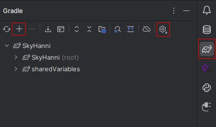
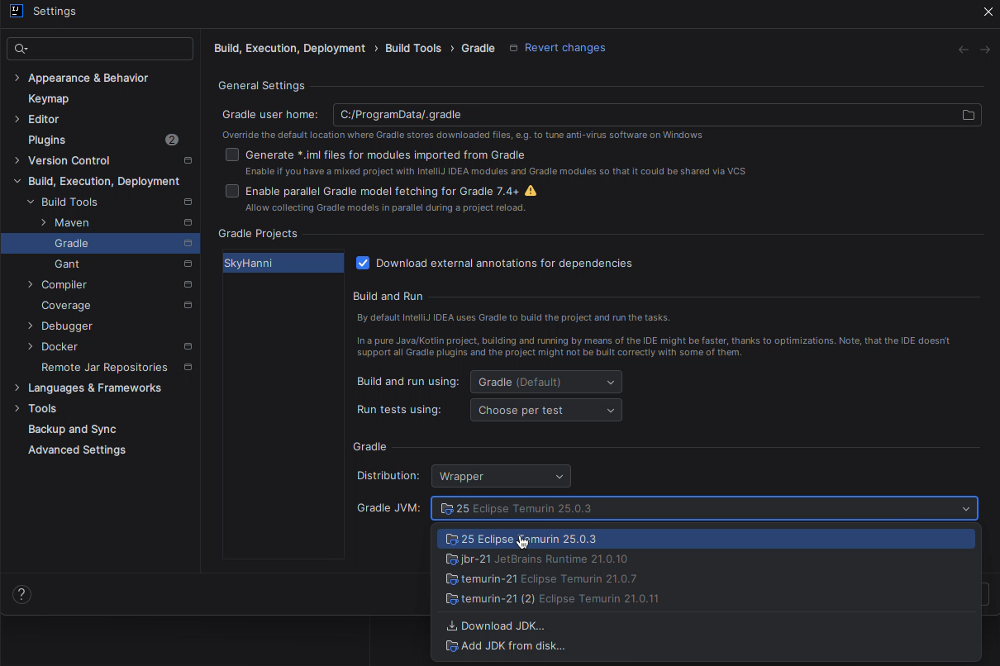
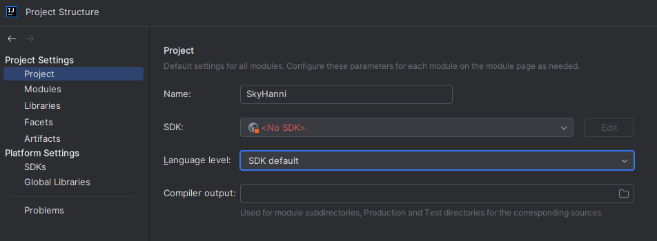
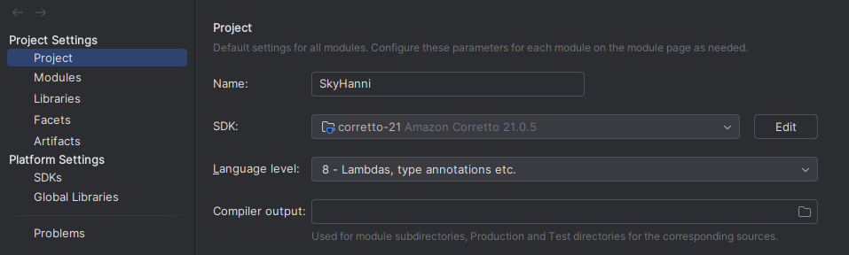
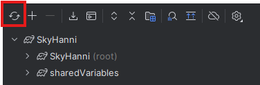
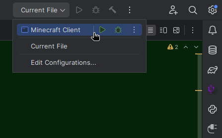

# How to Contribute

This is a technical guide that helps Kotlin and Java developers understand how SkyHanni works, and provides the first
steps for new Fabric developers to take.

## Development Environment Setup

When making changes to the code, it is recommended to use an IDE for live debugging and testing.
This tutorial explains how to set up the development environment for SkyHanni.
We use [IntelliJ](https://www.jetbrains.com/idea/) as an example.

### Download IntelliJ

- Download IntelliJ from the [JetBrains Website](https://www.jetbrains.com/idea/download/).
    - Use the Community Edition. (Scroll down a bit.)

### Cloning the project

- Create an account on GitHub
    - Go to https://github.com/hannibal002/SkyHanni
    - Click on the fork button to create a fork.
        - Leave the settings unchanged
        - Click on `create fork`
    - Open IntelliJ
        - Link the GitHub account with IntelliJ.
        - Install Git in IntelliJ.
        - In IntelliJ, go to `new` → `project from version control`.
        - Select `SkyHanni` from the list.
        - Open the project.

### Setting up IntelliJ

Once your project is imported into IntelliJ from the previous step, all dependencies like Minecraft and so on should be automatically
downloaded. If not, you might need to link the Gradle project in the Gradle tab (little elephant) on the right.

🖼️Show Gradle tab image

Make sure the Gradle JVM (found in the settings wheel in the Gradle tab, or by searching <kbd>Ctrl + Shift + A</kbd>
for "Gradle JVM") is set to a Java 25 JDK.

🖼️Show Gradle JVM image

Now that Gradle is done importing (which might take a few minutes the first time you download the project) we want to set up the java
version for the project.

To do this we press `(CTRL+ALT+SHIFT+S)` in IntelliJ, or go to `File` → `Project Structure...`.

🖼️ What the project structure will look like originally

We want to set the project structure to use Java 25.

🖼️ What you should set the project structure to be

Finally, we then want to reload Gradle which can be done from the Gradle tab from earlier.

🖼️ Show Gradle reload button

After all importing is done (which should be much quicker this time), you should find a new IntelliJ run
configuration. If not, you can restart IntelliJ and reload the Gradle project again.

🖼️Show run configuration selection image

Select an appropriate Java 25 JDK (preferably [Adoptium](https://adoptium.net/), but any Java 25 JDK will do).

🖼️Show run configuration image

Now that we are done with that, you should be able to launch your game from your IDE with that run configuration.

## Pull Requests

General infos about Pull Request can be found on
the [GitHub Docs](https://docs.github.com/en/pull-requests/collaborating-with-pull-requests/proposing-changes-to-your-work-with-pull-requests).

### Creating a Pull Request

If you are not very familiar with Git, you might want to check out some of these resources:

- [GitHub docs](https://docs.github.com/en/get-started/learning-to-code/getting-started-with-git)
- [Git tutorial video](https://www.youtube.com/watch?v=Ala6PHlYjmw)
- [Learn Git Branching](https://learngitbranching.js.org)

Proposed changes are best made in their own branch, as this makes development easier for both you and the maintainers of this repository.
You can do this by following the instructions within the IntelliJ window in the open SkyHanni project:

- Click the beta dropdown at the top of IntelliJ.
- Click **New branch**.
- Give the branch a name related to the changes you plan to make.

### Guidelines for Pull Requests

Please use a prefix for the PR name (e.g., Feature, Improvement, Fix, Backend, etc.).

When writing the PR description, ensure you fill out the template with all the necessary information.
In the **What** section, write technical details or explanations that don't belong in the changelog.
Including that field is optional for small changes.

If your PR relies on another PR, please include this information at the beginning of the description. Use the format `- #<pr number>`
for the dependency, or `- <url>` for REPO dependencies.

### Changelog Builder

The PR description is processed by our [ChangeLog Builder](https://github.com/SkyHanniStudios/SkyHanniChangelogBuilder), which is included
as a build dependency of the SkyHanni project. The `ChangelogVerification` Gradle task in `buildSrc/` uses it to validate PR descriptions in
CI. Do not manually edit `docs/CHANGELOG.md` or `docs/FEATURES.md`. These files are maintained by the project maintainer.

- Follow the format examples from the template and remove the categories that do not apply to your PR.
- A PR might include multiple changelog categories simultaneously.

Here is an explanation of which changes belong to each category:

#### New Features

New standalone features that are independent of existing features. Additional settings for existing features belong in the **Improvements**
category.

#### Improvements

Changes that improve or expand the code's logic and have a visible impact on users. This category is for enhancements, not for fixing
incorrect logic.
The line between bug fixes and improvements is sometimes not clear. If you are unsure whether a change is an improvement or a bug fix, ask
for guidance.

#### Fixes

Bug fixes, including typos (only those visible to the user, e.g., in config or chat messages), missing checks that cause incorrect behavior
under specific conditions, or logic errors.
Only significant performance issues are considered bugs; otherwise, they fall under **Technical Details**. If the code does not behave as
intended by the original developer, it is a bug. If the original code had logical errors, it is a bug. If the original code lacks nuance but
is not incorrect, it is not a bug.

#### Technical Details

Internal changes that do not impact the end user. Examples include:

- Refactoring (renaming or moving members, functions, classes, files or packages)
- Typos in object names (which the end user will not see)
- API updates
- Minor performance improvements (noticeable performance improvements belong in Improvements)
- Documentation changes to Markdown files, e.g., in `/docs` or this file.

Try to avoid using this when the main goal of the PR is a user facing change, and the included backend change is related to that change.
We mostly only need standalone changes or big/relevant backend changes marked as Technical Details,
everything else can go in the normal PR description (What area).

#### Removed Features

Features that have merged with existing features (in the config) or have become obsolete (e.g., if Hypixel implements them on the server
side).

#### No category

Some changes don't fit any categories.
E.g. when reverting pull requests or doing quick fixes to PRs merged immediately beforehand but not yet released in a beta.
To tell the changelog build this, write either `exclude_from_changelog` or `ignore_from_changelog` in one line.
Make sure such pull requests have a good explanation in the **What** section.

## Coding Styles and Conventions

- Follow the [Hypixel Rules](https://hypixel.net/rules).
- **Do not submit AI-generated content.**
    - This includes code, pull requests, issues, and review comments generated
      by tools such as GitHub Copilot, ChatGPT, Claude, or similar systems.
    - All contributions must be written and understood by the person submitting them. Using AI tools to help you
      *learn* something is fine, but the code and text you submit must be your own work.
    - AI-generated content often introduces subtle bugs, hallucinated APIs, or misleading context that costs
      reviewers significant time to identify. Contributors who repeatedly submit AI-generated content may be
      blocked from the repository.
- Use the coding conventions for [Kotlin](https://kotlinlang.org/docs/coding-conventions.html)
  and [Java](https://www.oracle.com/java/technologies/javase/codeconventions-contents.html).
- **My build is failing due to `detekt`, what do I do?**
    - `detekt` is our code quality tool. It checks for code smells and style issues.
    - When you open or update a pull request, Detekt runs automatically in CI. Any findings are posted as a comment on
      the PR listing the affected files, line numbers, and rule names.
    - If you have a build failure stating `Analysis failed with ... weighted issues.`, you can
      check `build/reports/detekt/` for a comprehensive list of issues.
    - **There are valid reasons to deviate from the norm**
        - If you have such a case, either use `@Suppress("rule_name")`, or re-build the `baseline-main.xml` file,
          using `./gradlew detektBaselineMain`.
- Do not copy features from other mods. Exceptions:
    - Mods that are paid to use.
    - Mods that have reached their end of life. (Rip SBA, Dulkir and Soopy).
    - The mod has, according to Hypixel rules, illegal features ("cheat mod/client").
    - If you can improve the existing feature in a meaningful way.
- All new classes should be written in Kotlin, with a few exceptions:
    - Mixin classes in `at.hannibal2.skyhanni.mixins.transformers`
    - Keep mixin code minimal. The mixin method should contain only a single call to a Kotlin function. All logic belongs in Kotlin.
- New features should be made in Kotlin objects unless there is a specific reason for it not to.
    - If the feature needs to register Fabric events, uses SkyHanni events or creates repo patterns, annotate the feature class with
      `@SkyHanniModule`
    - This will automatically register all events to the respective event bus, and loads the repo patterns.
    - Until the project is compiled for the first time, the IDE will show a red error in `SkyHanniMod.kt`. This is expected and resolves
      after the first build.
- Avoid using deprecated functions.
    - These functions are marked for removal in future versions.
    - If you're unsure why a function is deprecated or how to replace it, please ask for guidance.
- Future JSON data objects should be made in kotlin.
- Config files should be made in **Kotlin**.
    - There may be legacy config files left as Java files, however they will all be ported eventually.
- Please use the existing event system, or expand on it.
    - Custom SkyHanni events are located in the `events` package, organized into sub packages by category.
      When creating a new event, place it in the appropriate sub package. Thematically related events can be placed together in a single
      file.
    - To expand the event system, you can create a new event that is called from a Mixin,
      or you can subscribe to a Fabric event and then post a SkyHanni event from that.
      See the `api/minecraftevents` package for examples.
    - If you make a new event, make sure it extends one of these base types:
        - SkyHanniEvent: The base class for all events. Use this directly for simple events
          that don't need cancellation or rendering.
        - CancellableSkyHanniEvent: An event that listeners can cancel via `cancel()`,
          preventing further processing.
        - `GenericSkyHanniEvent<T>`: An event with a type parameter, allowing listeners to
          subscribe only for a specific type. For example, an event with type `Zombie`
          would only be received by listeners registered for that type. Generic events
          are also cancellable.
        - RenderingSkyHanniEvent: An event in which listeners are allowed to do GUI rendering.
    - Events can also use the `SkyHanniEvent.Cancellable` and `SkyHanniEvent.Rendering`
      interfaces directly if needed.
- Do not subscribe to Fabric events directly in feature classes. Instead, subscribe to SkyHanni events.
  Only backend data classes in the `api` packages should listen to Fabric events. Their job is to process
  the Fabric event and fire a corresponding SkyHanni event that feature classes then use.
  See the `api/minecraftevents` package for examples.
- Every event class must have a KDoc comment that describes: what the event represents,
  when it is fired, what each parameter means, and optionally, when to use or not use it.
    - For new events, the KDoc is required in the same PR.
    - For existing events, add the KDoc the next time the event is touched or newly used in a PR.
- Please use existing utils methods.
- Never use  `System.currentTimeMillis()`. Use our own class `SimpleTimeMark` instead.
    - See [this commit](https://github.com/hannibal002/SkyHanni/commit/3d748cb79f3a1afa7f1a9b7d0561e5d7bb284a9b)
      as an example.
- Try to avoid using Kotlin's `!!` (catch if not null) feature.
    - Replace it with `?:` (if null return this).
    - This will most likely not be possible to avoid when working with objects from java.
- Don't forget to add `@FeatureToggle` to new standalone features (not options to that feature) in the config.
- Do not use `e.printStackTrace()`, use `ErrorManager.logErrorWithData(error, "explanation for users", ...extraOptionalData)` instead.
- Do not use `toRegex()` or `toPattern()`. Use `RepoPattern` instead.
  RepoPattern allows regex patterns to be updated remotely via the repo without requiring a mod update.
  Each pattern has a local fallback defined in code, but can be overridden by the repo at runtime.
  See [RepoPattern.kt](https://github.com/hannibal002/SkyHanni/blob/beta/src/main/java/at/hannibal2/skyhanni/utils/repopatterns/RepoPattern.kt)
    - Define patterns using `RepoPattern.pattern(key, fallback)` with Kotlin delegation (`by`).
    - When a file contains more than one pattern, use `RepoPattern.group(prefix)` to group them under a shared key prefix.
    - Pattern variables should be named in the scheme `variableNamePattern`.
    - All repo patterns must be accompanied by a regex test. Add lines starting with `REGEX-TEST: `
      in a KDoc comment above the pattern variable to provide test examples.
    - Look at existing patterns in the codebase for reference.
- Please use Regex instead of String comparison when it is likely Hypixel will change the message in the future.
- Do not use `fixedRateTimer` when possible and instead use `SecondPassedEvent` to safely execute the repeating event on
  the main thread.
- When updating a config option variable, use the `ConfigUpdaterMigrator.ConfigFixEvent` with event.move() when moving a value, and
  event.transform() when updating a
  value. [For Example](https://github.com/hannibal002/SkyHanni/blob/beta/src/main/java/at/hannibal2/skyhanni/features/gui/customscoreboard/CustomScoreboard.kt#L276).
- Use American English spelling conventions (e.g., "color" not "colour").
- When creating/updating a command, move it out of the `Commands.kt` class, if it isn't already, into the class that it belongs to.
- Avoid direct function imports. Always access functions or members through their respective namespaces or parent classes to improve
  readability and maintain encapsulation. Extension functions are an exception to this rule.
- Use named parameters for boolean and numeric arguments where the meaning is not immediately clear from context (e.g.,
  `findMobHeight(height, above = true)` instead of `findMobHeight(height, true)`).
- Follow Kotlin conventions for acronym naming:
    - Use all-uppercase for two-letter acronyms (e.g., `XP`).
    - Treat three or more letter acronyms as regular words with only the first letter capitalized (e.g., `Api`).
- Always combine title messages with chat message.
    - This way users know what feature and what mod sends the title, if they want to disable it.
    - Also, we can include more information on why the title just showed up, as the title should not be too long.

## Additional Useful Development Tools

### DevAuth

[DevAuth](https://github.com/DJtheRedstoner/DevAuth) is a tool that allows logging in to a Minecraft account while
debugging in IntelliJ. This is very useful for coding live on Hypixel without the need to compile a jar.

- The library is already downloaded by Gradle.
- SkyHanni will automatically set up DevAuth.
- Start Minecraft inside IntelliJ normally.
    - Click on the link in the console and verify with a Microsoft account.
    - The verification process will reappear every few days (after the session token expires).

### [Live Plugin](https://plugins.jetbrains.com/plugin/7282-liveplugin)

Allows project specific plugins to run. Eg: Regex Intention

### [Live Templates Sharing](https://plugins.jetbrains.com/plugin/25007-live-templates-sharing)

Imports our custom live templates automatically. Live Templates allow for quicker code writing.

### [Minecraft Development](https://plugins.jetbrains.com/plugin/8327-minecraft-development)

Helps you write Minecraft specific code such as mixins and access wideners.

### [Stonecutter Development](https://plugins.jetbrains.com/plugin/25044-stonecutter-dev)

Provides syntax highlighting and quick version switching for our multiversion development setup.

## Software Used in SkyHanni

### Basics

SkyHanni is a Fabric mod for Minecraft, written in [Kotlin](https://kotlinlang.org/)
and [Java](https://www.java.com/en/).

We use a [Gradle configuration](https://gradle.org/) to build the mod,
written in [Kotlin DSL](https://docs.gradle.org/current/userguide/kotlin_dsl.html):
[build.gradle.kts](https://github.com/hannibal002/SkyHanni/blob/beta/build.gradle.kts)

This start script will automatically download all required libraries.

### NotEnoughUpdates Repo

SkyHanni reads the [NEU Item Repo](https://github.com/NotEnoughUpdates/NotEnoughUpdates-REPO) for item internal names, display names
and recipes. NEU is not a dependency of SkyHanni.

### Config

SkyHanni stores the config (settings and user data) as a JSON object in a single text file.
For rendering the /sh config (categories, toggles, search, etc.),
SkyHanni uses **[MoulConfig](https://github.com/NotEnoughUpdates/MoulConfig)**, the same config system as NotEnoughUpdates.

### Elite Farmers API

SkyHanni utilizes the [Elite API](https://api.eliteskyblock.com/) (view the [public site here](https://eliteskyblock.com)) for some farming
features and for LBIN price data.

This includes features relating to Farming Weight, as well as syncing Jacob contests amongst players for convenience. Features that upload
data to the Elite API are optional and opt-in. All requests to the Elite API are subject to
its [privacy policy](https://eliteskyblock.com/privacy).

### Mixin

A system to inject code into the original Minecraft code.
Mixin is bundled with the Fabric Loader and does not need to be included as a runtime dependency.

It allows to easily modify methods in Minecraft itself, without conflicting with other mods.

For more information, see https://github.com/SpongePowered/Mixin
or [our existing mixins](https://github.com/hannibal002/SkyHanni/tree/beta/src/main/java/at/hannibal2/skyhanni/mixins/transformers).

When creating new Mixins, try to keep the code inside the mixin as small as possible, and call a hook as soon as possible.
The mixin method itself should ideally contain only a single call to a Kotlin function. All logic belongs in Kotlin, not in the Java mixin.

### KSP (Kotlin Symbol Processing)

SkyHanni uses KSP via the `annotation-processors` module to generate code at compile time.

- `@SkyHanniModule`: Generates `LoadedModules.kt`, which registers all event handlers and repo patterns automatically.
- Mixin registration: Scans for `@Mixin`-annotated classes and generates the mixin configuration. There is no manual mixin list to update.

### Repo

SkyHanni uses a repo system to easily change static variables without the need for a mod update.
The repo is located at https://github.com/hannibal002/SkyHanni-REPO.
A copy of all JSON files is stored on the computer under `.minecraft\config\skyhanni\repo`.
On every game start, the copy gets updated (if outdated and if not manually disabled).
If you add stuff to the repo make sure it gets serialized. See
the [JsonObjects](src/main/java/at/hannibal2/skyhanni/data/jsonobjects/repo)
folder for how to properly do this. You also may have to disable repo auto update in game.

If your PR adds or changes data in the repo, open a separate PR on the [SkyHanni-REPO](https://github.com/hannibal002/SkyHanni-REPO)
repository as well.
Keep the main mod PR as a draft until the repo PR is ready.
Link the repo PR URL in the `## Dependencies` section of the mod PR.

### Discord IPC

DiscordIPC is a service that SkyHanni uses to send information from SkyBlock to Discord in Rich Presence.  
For info on usage, look
at [DiscordRPCManager.kt](https://github.com/hannibal002/SkyHanni/blob/beta/src/main/java/at/hannibal2/skyhanni/features/misc/discordrpc/DiscordRPCManager.kt)

### Auto Updater

We use the [auto update library](https://github.com/nea89o/libautoupdate) from nea89.

### Discord Bot

While not directly part of the Minecraft mod, it is useful to know that we have
a [Discord Bot](https://github.com/SkyHanniStudios/DiscordBot) that helps with small tasks related to PRs.

### Automated GitHub Workflows

Several GitHub Actions workflows run automatically on pull requests to enforce code quality and keep PR metadata up to date.
All workflows use `.github/scripts/pr_review.main.kts` as the shared review script, invoked with a `MODE` parameter.

When a PR is updated, any existing comment posted by a workflow is collapsed into a `
` spoiler. If issues still exist, a new
comment is posted at the bottom of the conversation. When all issues are resolved, the label is removed and no new comment is posted.

Most workflows use a two-workflow split to allow write-operations on fork PRs without granting untrusted code elevated permissions.
The first workflow is triggered by `pull_request`, runs with limited permissions, and uploads results as an artifact. The second is
triggered by `workflow_run` on completion of the first, always uses the base branch version, carries write access (`issues: write`,
`pull-requests: write`, `actions: read`), and runs the review script against the artifact. The PR number is resolved at runtime from
the head branch of the triggering workflow run. The Merge Conflict Comment and Dependency Label sections do not use this split.

#### Automated Detekt Review

Detekt runs automatically on every pull request. When findings are present, they are posted as a comment on the PR and the `Detekt`
label is applied.

- `.github/workflows/detekt.yml`: Triggered by `pull_request`. Runs with `contents: read` only. Runs `detektMain` and uploads the
  [SARIF](https://docs.github.com/en/code-security/reference/code-scanning/sarif-files/sarif-support)
  output as an artifact named `detekt-output`. Fork code never executes with write access.
- `.github/workflows/detekt-review.yml`: Triggered by `workflow_run` on completion of `detekt.yml`. Always uses the version from the
  base branch, so a fork PR cannot modify it. Runs with `issues: write`, `pull-requests: write`, and `actions: read`. Downloads the
  artifact to `runner.temp` (outside the workspace) and runs the review script. The script only reads the pre-generated SARIF, so fork
  code has no influence over what runs here.
- `.github/scripts/pr_review.main.kts` (invoked with `MODE=detekt`): Parses the SARIF, formats findings into a PR comment,
  manages the `Detekt` label, and handles the stale-comment logic.

#### Build Failure Notification

When the multi-version build fails on a pull request, the stack trace is posted as a comment on the PR and the `Fails Multi-Version`
label is applied.

- `.github/workflows/build.yml`: Triggered by `pull_request` and `push` to beta. On assemble failure, captures the Gradle output via
  `tee` inside `.github/actions/gradle-retry/action.yml`, saves it as a log file, and uploads it as an artifact named
  `build-failure-output-<version>` (one per matrix version). Uses `continue-on-error: true` on the assemble step so the artifact is
  uploaded before the job fails.
- `.github/workflows/build-review.yml`: Triggered by `workflow_run` on completion of `build.yml`. Always uses base branch code. Runs
  with `issues: write`, `pull-requests: write`, and `actions: read`. Downloads both version artifacts (`1.21.11` and `26.1`) with
  `continue-on-error: true`, resolves the PR number by branch name, and runs the review script.
- `.github/scripts/pr_review.main.kts` (invoked with `MODE=build`): Reads the log files, extracts a one-liner (first `e:`
  compiler error line) and the stack trace starting from `FAILURE: Build failed with an exception` (capped at 10,000 characters).
  Posts the result as a PR comment and manages the `Fails Multi-Version` label.

If no open PR matches the branch (e.g. for a direct push to beta), the script exits without posting a comment.

#### Merge Conflict Comment

When a pull request has merge conflicts with the base branch, the `Merge Conflicts` label is applied and a comment is posted. When
conflicts are resolved, the comment is collapsed into a `
` spoiler and the label is removed without posting a new comment.

- `.github/workflows/label-merge-conflict.yml`: Triggered by `pull_request_target` on `opened` and `synchronize` events, and by `push` to
  beta. Runs with `issues: write` and `pull-requests: write`. Does not use the two-workflow split because `pull_request_target` already
  provides write access while running base branch code. On a push to beta, no PR number is available and all open PRs are rechecked.
- `.github/scripts/pr_review.main.kts` (invoked with `MODE=mergeconflict`): Queries the GitHub Pulls API for the `mergeable` field of
  the PR. If `null` (GitHub has not yet computed the state), the script exits without making any changes. If `false`, an existing conflict
  comment is staled and a new one is posted, and the label is added. If `true`, an existing conflict comment is staled and the label is
  removed.

#### Changelog Check Comment

When a pull request has changelog or title issues detected by the `checkPrDescription` Gradle task, the `Wrong Title/Changelog` label is
applied and a comment is posted with the list of issues. When the issues are resolved, the comment is collapsed into a `
` spoiler
and the label is removed.

The `checkPrDescription` task writes a formatted `changelog_errors.txt` to `build/changelog-verification/` on failure. The comment
content is read directly from this file without additional parsing.

- `.github/workflows/pr-check.yml`: Triggered by `pull_request` on `opened`, `edited`, `ready_for_review`, and `synchronize` events. The
  `checkPrDescription` steps run with `continue-on-error: true` and upload `build/changelog-verification/changelog_errors.txt` as
  the `changelog-check-failure` artifact on failure. A separate step at the end fails the job so the overall check result is still a
  failure.
- `.github/workflows/changelog-review.yml`: Triggered by `workflow_run` on completion of `pr-check.yml`. Always uses base branch code.
  Runs with `issues: write`, `pull-requests: write`, and `actions: read`. Downloads the artifact, resolves the PR number by branch name,
  and runs the review script.
- `.github/scripts/pr_review.main.kts` (invoked with `MODE=changelog`): Reads `changelog_errors.txt` from the artifact directory.
  If the file is present, it stales any existing comment and posts a new one, then adds the label. If the file is absent (check passed), it
  stales any existing comment and removes the label.

#### Dependency Label

When a pull request declares dependencies in its `## Dependencies` section, the `Waiting on Dependency PR` label is automatically added or
removed based on whether any listed dependencies are still open.

Two dependency formats are supported:

- `- #<pr number>` for same-repository PRs
- `- <url>` for external repository PRs

Dependencies on `hannibal002/SkyHanni-REPO` are explicitly excluded from the open check, as that repository is considered part of the same
release unit.

The check runs on every `opened`, `edited`, `closed`, and `synchronize` event via `pull_request_target`. On `closed`, all open PRs currently carrying the
label are re-evaluated so the label is removed from dependent PRs when their dependency merges.

Known limitation: if a dependency PR in an external repository merges, the workflow does not fire for that repository. The label on the
dependent PR remains until the PR itself is edited or another supported event occurs.

Relevant files: `.github/workflows/check_dependencies.yml`, `.github/scripts/pr_review.main.kts`.

## Access Wideners

You may want to use private Minecraft methods or fields, this is where access wideners come in.
Access wideners are a way to access private methods and fields in Minecraft classes. They are used to modify the access level of a method or
field and allow it to be accessed from other classes. This is an easier alternative to using mixins and making an accessor.
To get an access widener entry, you can use the Minecraft Development plugin for IntelliJ. Then you can right-click on a method or field and
select `Copy / Paste Special` -> `AW Entry` and paste this into the bottom
of `src/main/resources/skyhanni.classtweaker`.
Then you need to reload Gradle for the changes to apply.

This requires you to have the Minecraft Development plugin installed as mentioned earlier.
